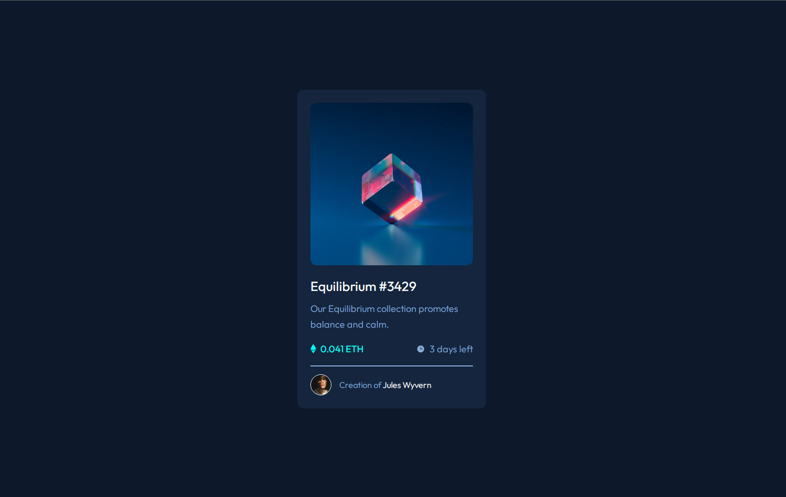

<h1 align="center"> Componente de cartão de visualização NFT </h1>

    

## Descrição

Criação de um componente de cartão de visualização  feito com html e css. O layout foi desenvolvido pela empresa **Frontend Mentor** que disponibilizou gratuitamente o designer com objetivo de teste pratico de habilidades. Na pasta DOC você encontra toda a documentação do projeto como layout e desafio proposto.

## Desafio proposto

os usuários devem ser capazes de:

* Veja o layout ideal dependendo do tamanho da tela do dispositivo
* Veja estados de foco para elementos interativos

## Construído com

* [HTML](https://www.w3schools.com/html/) - HTML abreviação para a expressão inglesa HyperText Markup Language, que significa: "Linguagem de Marcação de Hipertexto" é uma linguagem de marcação utilizada na construção de páginas na Web. Documentos HTML podem ser interpretados por navegadores. A tecnologia é fruto da junção entre os padrões HyTime e SGML.

* [CSS](https://www.w3schools.com/css/default.asp) - Cascading Style Sheets é um mecanismo para adicionar estilo a um documento web. O código CSS pode ser aplicado diretamente nas tags ou ficar contido dentro das tags "style". Também é possível, em vez de colocar a formatação dentro do documento, criar um link para um arquivo CSS que contém os estilos.

## Status do Projeto

**Concluido**: O projeto esta terminado, não havera futuras alterações de funcionalidade.

## Autor

* **Cesar dos Santos de Almeida** - *responsável pela construção e desenvolvimento do projeto*

## Licença
Este projeto está licenciado sob a licença MIT - consulte o arquivo  [LICENSE.md](LICENSE.md) para obter detalhes

## Links
* [NFT preview card component](https://www.frontendmentor.io/challenges/nft-preview-card-component-SbdUL_w0U) - link do desafio do Frontend Mentor.
* [Frontend Mentor](https://www.frontendmentor.io/) - Responsável por disponibilizar o desafio e os materiais como ilustrações e imagens para a criação do site

